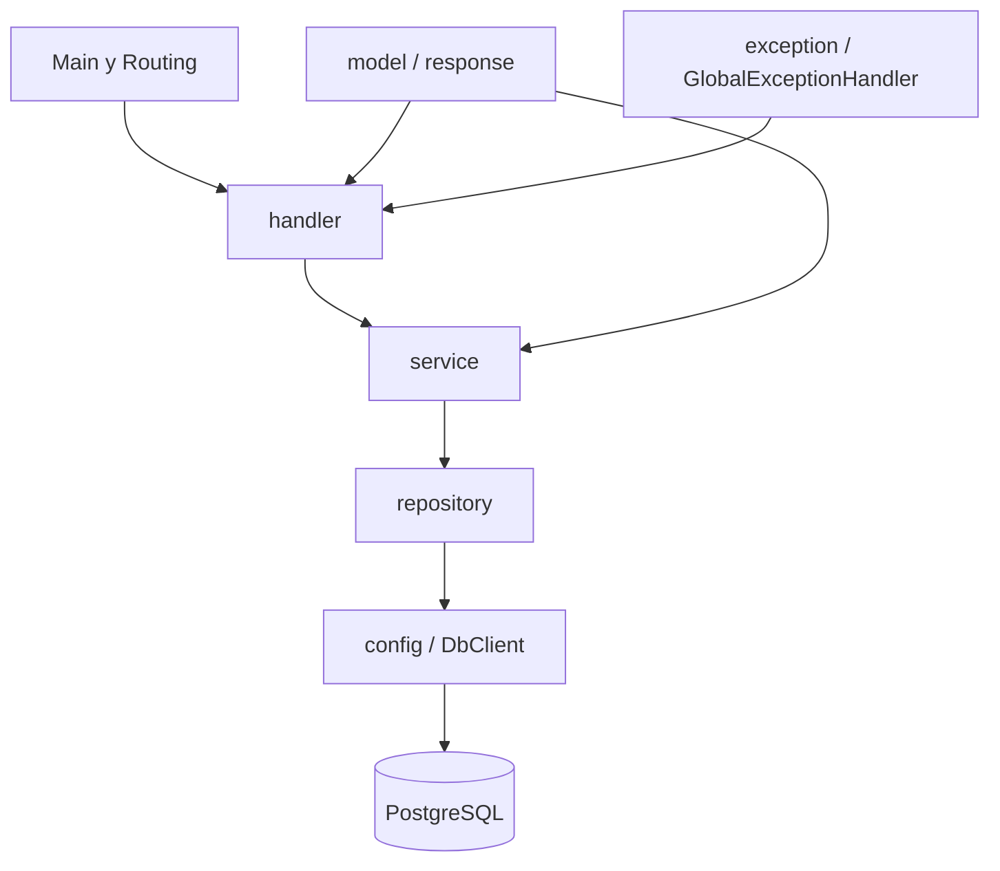
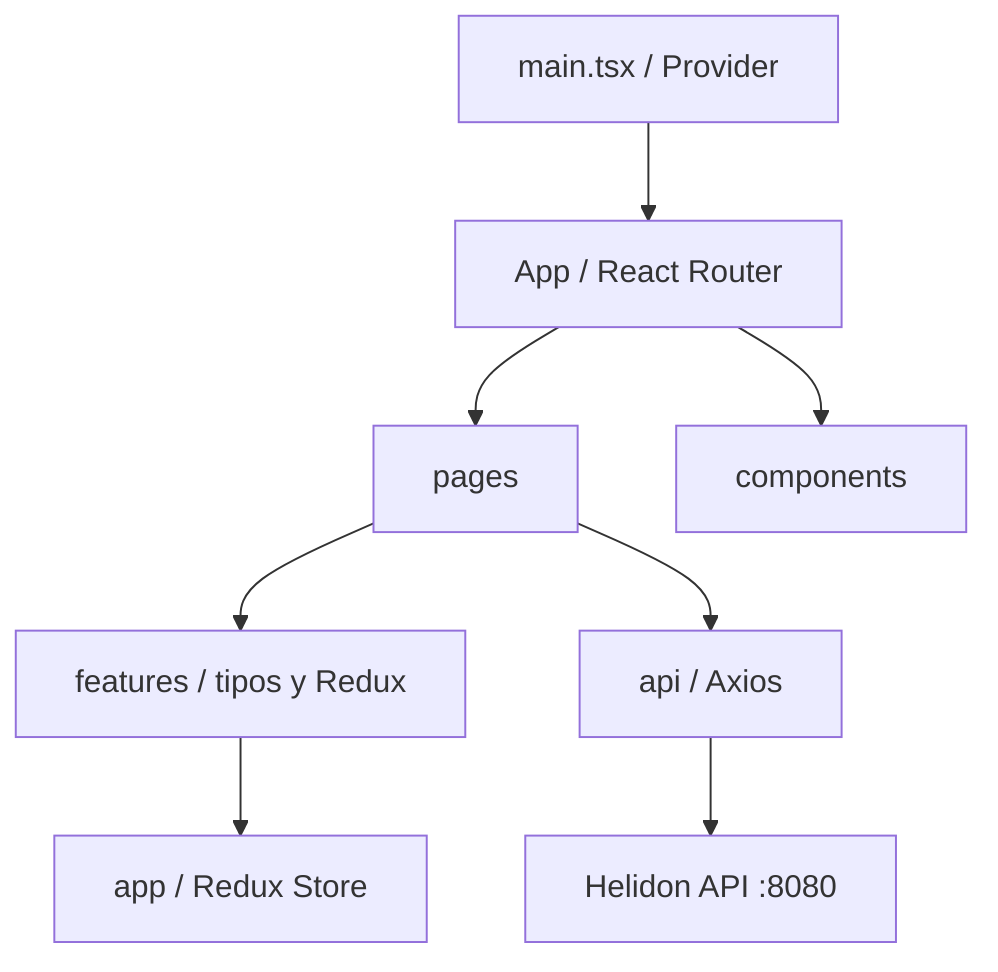
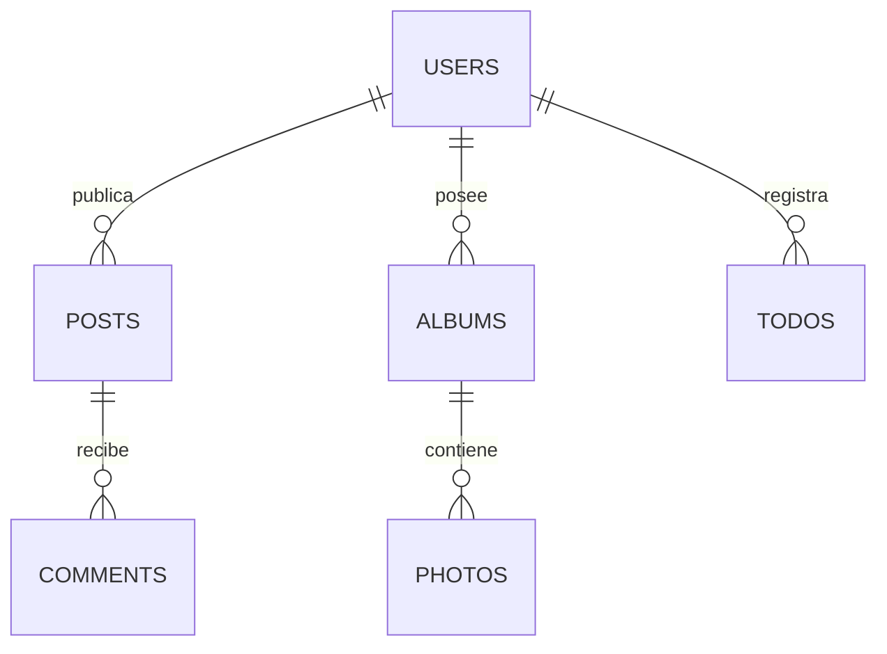

# Trabajo Grupal 1: API REST con Helidon SE 4.5

Aplicación full stack para administrar usuarios, publicaciones, comentarios, álbumes, fotos y tareas. El backend utiliza Helidon SE 4.5, Java 21, DbClient, JDBC, HikariCP y PostgreSQL. El frontend utiliza React, TypeScript, Vite, React Router y Redux Toolkit.

## Integrantes


- `Casagallo Carlosama Diego Eduardo ` - Cédula: `1725404519`
- `De La Cruz Edwin Alexander ` - Cédula: `1751707785`
- `Celi Díaz Kevin Francisco ` - Cédula: `1753495892`
- `Ninabanda Pambabay Jhonny Eduardo ` - Cédula: `1722642350`


## Funcionalidades implementadas

- CRUD completo de `users`, `posts`, `comments`, `albums`, `photos` y `todos`.
- 30 endpoints REST con los códigos HTTP solicitados.
- Persistencia real en PostgreSQL mediante Helidon DbClient y HikariCP.
- Validación de claves foráneas en POST y PUT.
- Errores centralizados con el formato `{"error":"mensaje"}`.
- CORS para `http://localhost:5173`, incluyendo solicitudes `OPTIONS`.
- Eliminación en cascada mediante las restricciones `ON DELETE CASCADE` del SQL.
- Frontend React con navegación declarativa y estado global mediante Redux Toolkit.
- Dashboard con cantidades reales obtenidas del backend.
- Paginación de Fotos con 25, 50, 100 o 500 filas por página.

## Estructura de la entrega

```text
tarea-grupal/
├── backend/                 # Proyecto Gradle y API Helidon SE
│   ├── gradle/
│   ├── src/main/java/
│   ├── src/main/resources/application.yaml
│   ├── build.gradle.kts
│   ├── gradlew
│   └── gradlew.bat
├── database/
│   ├── 01-create-tables.sql
│   └── 02-insert-data.sql
├── docs/evidencias/         # Capturas usadas en este documento
├── web/                     # Proyecto React + TypeScript + Vite
└── README.md
```

## Mapeo del framework eliminado a módulo Helidon 4.5

| Dependencia o tecnología eliminada | Sustitución en Helidon SE 4.5 |
|---|---|
| `org.jboss.resteasy:resteasy-core` | `io.helidon.webserver:helidon-webserver` |
| `org.jboss.resteasy:resteasy-undertow-cdi` | No requerido; Helidon SE no utiliza CDI |
| `resteasy-json-binding-provider` | `io.helidon.http.media:helidon-http-media-jsonb` |
| `org.hibernate.orm:hibernate-core` | `io.helidon.dbclient:helidon-dbclient` y `helidon-dbclient-jdbc` |
| Pool de conexiones anterior | `io.helidon.dbclient:helidon-dbclient-hikari` |
| Configuración anterior | `io.helidon.config:helidon-config-yaml` |
| JPA y `jakarta.persistence.*` | Consultas SQL con Helidon DbClient y mapeo explícito de filas |
| Jakarta CDI | Composición manual de dependencias en `Main` |
| Anotaciones JAX-RS | Registro declarativo de rutas con `routing.get/post/put/delete` |
| Driver PostgreSQL | Se conserva `org.postgresql:postgresql` |

Todos los módulos Helidon se gestionan con el BOM `io.helidon:helidon-bom:4.5.0`.

## Versiones del frontend

Las versiones se encuentran declaradas en `web/package.json`.

| Tecnología | Versión declarada | Uso |
|---|---:|---|
| React | 19.2.7 | Componentes e interfaz de usuario |
| React DOM | 19.2.7 | Renderizado en el navegador |
| Vite | 8.1.1 | Servidor de desarrollo y compilación |
| React Router DOM | 7.18.1 | Navegación declarativa entre páginas |
| Redux Toolkit | 2.12.0 | Gestión del estado global de usuarios |
| React Redux | 9.3.0 | Integración de Redux con React |
| TypeScript | 6.0.2 | Tipado estricto del frontend |
| Axios | 1.18.1 | Consumo de la API REST |
| Material UI | 9.2.0 | Componentes visuales |

## Versiones principales del backend

| Tecnología | Versión |
|---|---:|
| Java | 21 |
| Helidon SE | 4.5.0 |
| PostgreSQL JDBC | 42.7.7 |
| Gradle Wrapper | 9.3.0 |
| PostgreSQL usado durante las pruebas | 16.1 |

## Arquitectura

### Diagrama de paquetes del backend



- `Main`: carga la configuración, compone manualmente las dependencias y registra las rutas.
- `handler`: transforma solicitudes y respuestas HTTP.
- `service`: contiene las validaciones, incluidas las claves foráneas.
- `repository`: ejecuta consultas mediante DbClient.
- `model`: contiene los modelos de las seis entidades.
- `util`: implementa CORS y el manejo centralizado de errores.

### Diagrama de paquetes del frontend



- `pages`: pantallas CRUD de las seis entidades y Dashboard.
- `components`: barra de navegación y mensajes de la aplicación.
- `features`: tipos TypeScript y estado global de usuarios.
- `app`: store y hooks tipados de Redux.
- `api`: cliente Axios que consume `/api` mediante el proxy de Vite.

## Modelo y relaciones



Las claves foráneas tienen `ON DELETE CASCADE` en el esquema SQL.

## Requisitos previos

- Java JDK 21 o superior.
- PostgreSQL en ejecución.
- Node.js y npm.
- Puerto `5432` disponible para PostgreSQL o ajuste equivalente en `application.yaml`.
- Puertos `8080` y `5173` disponibles.

## Preparación de PostgreSQL

1. Crear una base de datos llamada `rest_post`.
2. Conectarse a `rest_post`.
3. Ejecutar `database/01-create-tables.sql`.
4. Ejecutar `database/02-insert-data.sql`.

Los datos iniciales esperados son:

| Entidad | Cantidad inicial |
|---|---:|
| Users | 10 |
| Posts | 100 |
| Comments | 500 |
| Albums | 100 |
| Photos | 5000 |
| Todos | 200 |

## Configuración del backend

Editar `backend/src/main/resources/application.yaml` antes de iniciar la aplicación:

```yaml
server:
  host: "0.0.0.0"
  port: 8080

db:
  source: jdbc
  connection:
    url: "jdbc:postgresql://localhost:5432/rest_post"
    username: "postgres"
    password: "SU_PASSWORD_LOCAL"
```

El archivo incluido contiene además la configuración comentada del pool HikariCP y de CORS. La contraseña debe coincidir con la instalación local de PostgreSQL.

## Orden de ejecución

El backend debe iniciarse antes que el frontend.

### 1. Backend en Windows

```powershell
cd backend
.\gradlew.bat clean build
.\gradlew.bat run
```

### Backend en Linux o macOS

```bash
cd backend
./gradlew clean build
./gradlew run
```

La API queda disponible en `http://localhost:8080`.

### 2. Frontend

Abrir otra terminal sin cerrar el backend:

```powershell
cd web
npm install
npm run build
npm run dev
```

La aplicación queda disponible en `http://localhost:5173`.

## Evidencia de compilación y ejecución

### Backend compilado


### Backend ejecutándose en el puerto 8080


### Frontend

La compilación ejecutada durante la verificación produjo:

```text
vite v8.1.4 building client environment for production...
978 modules transformed.
dist/index.html
dist/assets/index-*.js
built successfully
```


## Transcripción de los 30 endpoints

Base URL utilizada: `http://localhost:8080/api`.

Las listas extensas se muestran abreviadas en el documento, pero durante las pruebas se verificó el contenido completo y sus cantidades.

### Users

#### 1. GET `/api/users`

```http
GET /api/users
Request body: ninguno
Response: 200 OK
[{"id":1,"name":"Leanne Graham","username":"Bret","email":"Sincere@april.biz",...}, ...]
Cantidad inicial verificada: 10
```

#### 2. GET `/api/users/1`

```http
GET /api/users/1
Response: 200 OK
{"addressCity":"Gwenborough","addressGeoLat":-37.3159,"addressGeoLng":81.1496,
 "addressStreet":"Kulas Light","addressSuite":"Apt. 556","addressZipcode":"92998-3874",
 "companyBs":"harness real-time e-markets","companyCatchPhrase":"Multi-layered client-server neural-net",
 "companyName":"Romaguera-Crona","email":"Sincere@april.biz","id":1,
 "name":"Leanne Graham","phone":"1-770-736-8031 x56442","username":"Bret",
 "website":"hildegard.org"}
```

#### 3. POST `/api/users`

```http
POST /api/users
Content-Type: application/json
Request: {"name":"Usuario Prueba","username":"prueba","email":"prueba@example.com"}
Response: 201 Created
{"email":"prueba@example.com","id":11,"name":"Usuario Prueba","username":"prueba"}
```

#### 4. PUT `/api/users/11`

```http
PUT /api/users/11
Content-Type: application/json
Request: {"name":"Usuario Actualizado","username":"actualizado","email":"actualizado@example.com"}
Response: 204 No Content
Response body: vacío
```

#### 5. DELETE `/api/users/11`

```http
DELETE /api/users/11
Response: 204 No Content
Response body: vacío
```

### Posts

#### 6. GET `/api/posts`

```http
GET /api/posts
Response: 200 OK
[{"id":1,"userId":1,"title":"sunt aut facere repellat provident occaecati excepturi optio reprehenderit","body":"quia et suscipit..."}, ...]
Cantidad inicial verificada: 100
```

#### 7. GET `/api/posts/1`

```http
GET /api/posts/1
Response: 200 OK
{"body":"quia et suscipit\nsuscipit recusandae consequuntur expedita et cum...",
 "id":1,"title":"sunt aut facere repellat provident occaecati excepturi optio reprehenderit",
 "userId":1}
```

#### 8. POST `/api/posts`

```http
POST /api/posts
Content-Type: application/json
Request: {"userId":1,"title":"Post de prueba","body":"Contenido del post de prueba"}
Response: 201 Created
{"body":"Contenido del post de prueba","id":101,"title":"Post de prueba","userId":1}
```

#### 9. PUT `/api/posts/101`

```http
PUT /api/posts/101
Content-Type: application/json
Request: {"userId":1,"title":"Post actualizado","body":"Contenido actualizado"}
Response: 204 No Content
Response body: vacío
```

#### 10. DELETE `/api/posts/101`

```http
DELETE /api/posts/101
Response: 204 No Content
Response body: vacío
```

### Comments

#### 11. GET `/api/comments`

```http
GET /api/comments
Response: 200 OK
[{"id":1,"postId":1,"name":"id labore ex et quam laborum","email":"Eliseo@gardner.biz","body":"laudantium enim..."}, ...]
Cantidad inicial verificada: 500
```

#### 12. GET `/api/comments/1`

```http
GET /api/comments/1
Response: 200 OK
{"body":"laudantium enim quasi est quidem magnam voluptate ipsam...",
 "email":"Eliseo@gardner.biz","id":1,"name":"id labore ex et quam laborum","postId":1}
```

#### 13. POST `/api/comments`

```http
POST /api/comments
Content-Type: application/json
Request: {"postId":1,"name":"Comentario de prueba","email":"comentario@example.com","body":"Contenido del comentario"}
Response: 201 Created
{"body":"Contenido del comentario","email":"comentario@example.com","id":501,
 "name":"Comentario de prueba","postId":1}
```

#### 14. PUT `/api/comments/501`

```http
PUT /api/comments/501
Content-Type: application/json
Request: {"postId":1,"name":"Comentario actualizado","email":"actualizado@example.com","body":"Contenido actualizado"}
Response: 204 No Content
Response body: vacío
```

#### 15. DELETE `/api/comments/501`

```http
DELETE /api/comments/501
Response: 204 No Content
Response body: vacío
```

### Albums

#### 16. GET `/api/albums`

```http
GET /api/albums
Response: 200 OK
[{"id":1,"title":"quidem molestiae enim","userId":1}, ...]
Cantidad inicial verificada: 100
```

#### 17. GET `/api/albums/1`

```http
GET /api/albums/1
Response: 200 OK
{"id":1,"title":"quidem molestiae enim","userId":1}
```

#### 18. POST `/api/albums`

```http
POST /api/albums
Content-Type: application/json
Request: {"userId":1,"title":"Álbum de prueba"}
Response: 201 Created
{"id":101,"title":"Álbum de prueba","userId":1}
```

#### 19. PUT `/api/albums/101`

```http
PUT /api/albums/101
Content-Type: application/json
Request: {"userId":1,"title":"Álbum actualizado"}
Response: 204 No Content
Response body: vacío
```

#### 20. DELETE `/api/albums/101`

```http
DELETE /api/albums/101
Response: 204 No Content
Response body: vacío
```

### Photos

#### 21. GET `/api/photos`

```http
GET /api/photos
Response: 200 OK
[{"albumId":1,"id":1,"thumbnailUrl":"https://via.placeholder.com/150/92c952",
  "title":"accusamus beatae ad facilis cum similique qui sunt",
  "url":"https://via.placeholder.com/600/92c952"}, ...]
Cantidad inicial verificada: 5000
```

#### 22. GET `/api/photos/1`

```http
GET /api/photos/1
Response: 200 OK
{"albumId":1,"id":1,"thumbnailUrl":"https://via.placeholder.com/150/92c952",
 "title":"accusamus beatae ad facilis cum similique qui sunt",
 "url":"https://via.placeholder.com/600/92c952"}
```

#### 23. POST `/api/photos`

```http
POST /api/photos
Content-Type: application/json
Request: {"albumId":1,"title":"Foto de prueba","url":"https://example.com/foto.jpg",
          "thumbnailUrl":"https://example.com/miniatura.jpg"}
Response: 201 Created
{"albumId":1,"id":5001,"thumbnailUrl":"https://example.com/miniatura.jpg",
 "title":"Foto de prueba","url":"https://example.com/foto.jpg"}
```

#### 24. PUT `/api/photos/5001`

```http
PUT /api/photos/5001
Content-Type: application/json
Request: {"albumId":1,"title":"Foto actualizada","url":"https://example.com/foto-actualizada.jpg",
          "thumbnailUrl":"https://example.com/miniatura-actualizada.jpg"}
Response: 204 No Content
Response body: vacío
```

#### 25. DELETE `/api/photos/5001`

```http
DELETE /api/photos/5001
Response: 204 No Content
Response body: vacío
```

### Todos

#### 26. GET `/api/todos`

```http
GET /api/todos
Response: 200 OK
[{"completed":false,"id":1,"title":"delectus aut autem","userId":1}, ...]
Cantidad inicial verificada: 200
```

#### 27. GET `/api/todos/1`

```http
GET /api/todos/1
Response: 200 OK
{"completed":false,"id":1,"title":"delectus aut autem","userId":1}
```

#### 28. POST `/api/todos`

```http
POST /api/todos
Content-Type: application/json
Request: {"userId":1,"title":"Tarea de prueba","completed":false}
Response: 201 Created
{"completed":false,"id":201,"title":"Tarea de prueba","userId":1}
```

#### 29. PUT `/api/todos/201`

```http
PUT /api/todos/201
Content-Type: application/json
Request: {"userId":1,"title":"Tarea actualizada","completed":true}
Response: 204 No Content
Response body: vacío
```

#### 30. DELETE `/api/todos/201`

```http
DELETE /api/todos/201
Response: 204 No Content
Response body: vacío
```

## Pruebas adicionales requeridas

### Respuestas 404

Después de eliminar los recursos de prueba, una segunda consulta o eliminación devolvió:

```http
GET /api/users/11       -> 404 {"error":"Usuario no encontrado"}
GET /api/posts/101      -> 404 {"error":"Post no encontrado"}
GET /api/comments/501   -> 404 {"error":"Comentario no encontrado"}
GET /api/albums/101     -> 404 {"error":"Álbum no encontrado"}
GET /api/photos/5001    -> 404 {"error":"Foto no encontrada"}
GET /api/todos/201      -> 404 {"error":"Tarea no encontrada"}
```

### Validación de claves foráneas

Se enviaron IDs inexistentes (`999999`) en los POST correspondientes:

```http
POST /api/posts     -> 400 {"error":"userId no existe"}
POST /api/comments  -> 400 {"error":"postId no existe"}
POST /api/albums    -> 400 {"error":"userId no existe"}
POST /api/photos    -> 400 {"error":"albumId no existe"}
POST /api/todos     -> 400 {"error":"userId no existe"}
```

### CORS y preflight OPTIONS

Solicitud utilizada:

```http
OPTIONS /api/users
Origin: http://localhost:5173
Access-Control-Request-Method: POST
```

Resultado:

```http
204 No Content
Access-Control-Allow-Origin: http://localhost:5173
Access-Control-Allow-Methods: GET, POST, PUT, DELETE, OPTIONS
Access-Control-Allow-Headers: Content-Type
```


### Verificación de ON DELETE CASCADE

Se crearon y verificaron los siguientes recursos relacionados:

```text
User 11
├── Post 101
│   └── Comment 501
├── Album 101
│   └── Photo 5001
└── Todo 201
```

Todos devolvieron `200 OK` antes de eliminar el usuario. Después de ejecutar `DELETE /api/users/11`, se obtuvo `204 No Content` y las verificaciones devolvieron:

```http
GET /api/posts/101      -> 404 {"error":"Post no encontrado"}
GET /api/comments/501   -> 404 {"error":"Comentario no encontrado"}
GET /api/albums/101     -> 404 {"error":"Álbum no encontrado"}
GET /api/photos/5001    -> 404 {"error":"Foto no encontrada"}
GET /api/todos/201      -> 404 {"error":"Tarea no encontrada"}
```

Esto confirma la cascada `User -> Post -> Comment`, `User -> Album -> Photo` y `User -> Todo` definida en PostgreSQL.

## Evidencias del frontend

### Dashboard

El Dashboard mostró las cantidades iniciales proporcionadas por el SQL:


Al crear un usuario, el contador cambió de 10 a 11, demostrando que consulta datos reales:


### CRUD de Users

Creación:


Edición:


Confirmación y resultado de eliminación:


### CRUD de Posts

Creación:


Edición:


Eliminación, donde el registro 101 ya no aparece:


### CRUD de Comments

Creación:


Edición:


Eliminación, donde el registro 501 ya no aparece:


### Paginación de Fotos

La tabla permite mostrar 25, 50, 100 o 500 filas y navegar directamente a la primera o última página. Esto evita renderizar 5.000 filas simultáneamente sin modificar la respuesta del endpoint GET.


## Lista de verificación

- [x] Java 21.
- [x] Helidon SE 4.5 sin RESTEasy, Hibernate, JPA ni CDI.
- [x] DbClient, JDBC y HikariCP.
- [x] PostgreSQL y datos SQL proporcionados.
- [x] 30 endpoints CRUD.
- [x] Códigos 200, 201, 204, 400, 404 y 500 contemplados.
- [x] JSON en solicitudes y respuestas.
- [x] CORS para Vite y OPTIONS.
- [x] Validaciones de claves foráneas.
- [x] Cascada comprobada.
- [x] Configuración externa comentada en YAML.
- [x] React + TypeScript + Vite.
- [x] React Router.
- [x] Redux Toolkit como estado global.
- [x] CRUD web probado en las seis entidades.
- [x] Backend y frontend compilados.
- [ ] Completar nombres y cédulas de los integrantes.

